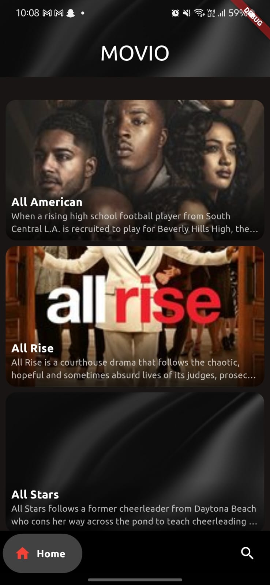
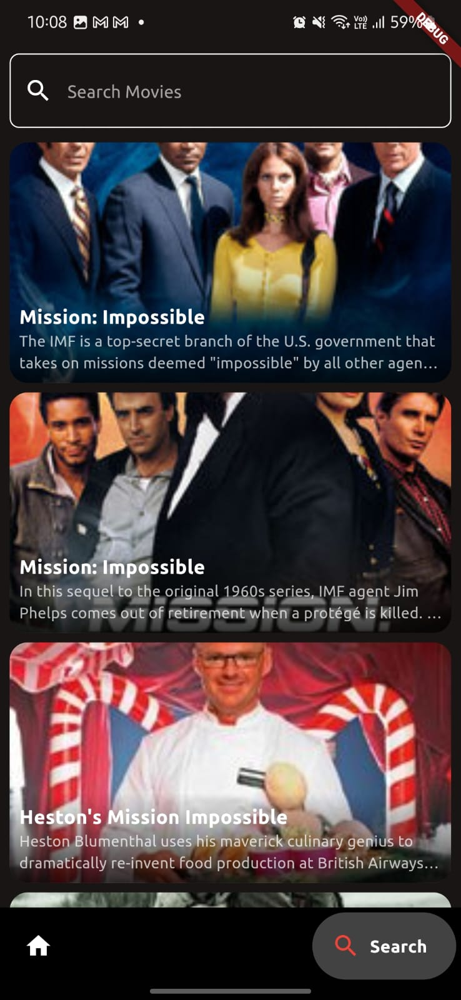

# Movio

Movio is a Flutter application that allows users to browse and search for movies. The app fetches movie data from the TVMaze API and displays it in a user-friendly interface.

## Features

- Browse a list of movies
- Search for movies by name
- View detailed information about each movie
- Responsive UI with a custom bottom navigation bar
- "Read More" feature for movie summaries

## Screenshots


  

## Installation

1. **Clone the repository:**

    ```sh
    git clone https://github.com/yourusername/movio.git
    cd movio
    ```

2. **Install dependencies:**

    ```sh
    flutter pub get
    ```

3. **Run the app:**

    ```sh
    flutter run
    ```

## Usage

- **Home Screen:** Browse a list of movies.
- **Search Screen:** Search for movies by name.
- **Detail Screen:** View detailed information about a selected movie.

## Project Structure

```plaintext
lib/
├── main.dart
├── models/
│   └── movie_model.dart
├── providers/
│   └── movie_provider.dart
├── screens/
│   ├── detail_screen.dart
│   ├── home_screen.dart
│   ├── movies_page.dart
│   └── search_screen.dart
├── services/
│   └── api_services.dart
├── utils/
│   ├── constants.dart
│   └── html_string_helper.dart
└── widgets/
    ├── movie_card.dart
    └── nav_bar.dart
```

## Dependencies:
- provider
- http
- expandable_text
- google_nav_bar
- flutter_native_splash
